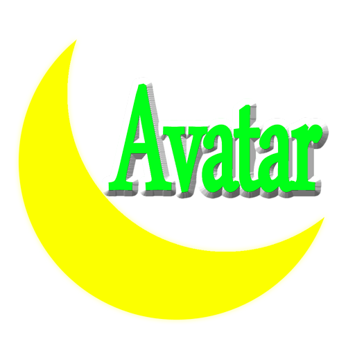

# Avatar - 跨平台高性能3D引擎

##简介##
<hr>
这是我的一个业余项目，Avatar 是一款跨平台高性能的3D引擎，底层采用 C++ 开发，目前支持 Windows、Linux、
Android 三个平台。渲染部分基于 OpenGL3.3/ES3.0，引擎具有很高的可移植性，除了 freetype、glew、libcurl、
libjpeg、libpng、lua、minimp3、openal、rapidxml、zlib 这些开源的第三方库以外无其他依赖库。引擎的特点是
简单高效的同时提供非常丰富的功能，关于引擎名称 Avatar (译：女神)藏有一段小故事，它是我大学新学到的第一
个单词(^_^)。部分特性见下方介绍。关于作者和引擎详见 http://blog.csdn.net/luoyexunxue。对于引擎的使用，
可参考 [##编译##]

引擎的部分特性：
<br/>
-# <b>支持多种纹理格式 BMP TGA PNG JPG，同时支持程序纹理</b>
-# <b>支持载入动画模型 MS3D DAE GLTF 和静态模型 OBJ STL 3DS 以及骨骼动画 BVH 并可配置自定义加载器</b>
-# <b>基于 OpenAL 的 3D 音效，支持 WAV 和 MP3 格式音频载入</b>
-# <b>集成 FreeType 字体库，支持自定义字体显示</b>
-# <b>集成 Lua 脚本引擎，支持使用 Lua 与引擎的交互，基于脚本的 GUI 系统，具有非常灵活的事件处理能力</b>
-# <b>能够实现诸如实时监控，摄像头视频采集，摄像头控制等功能</b>
-# <b>实现了一个小型快速的物理引擎，能够进行刚体模拟</b>
-# <b>内建多种后处理，如立体视觉透视矫正，HDR，FXAA，红蓝3D，VolumeLight 以及用户自定义后处理</b>
-# <b>支持场景节点动画，包括缩放，旋转，平移，包含多种动画方式</b>
-# <b>包含多种相机，可完成诸如第一人称游戏、第三人称游戏、模型浏览、飞行模拟、VR模式等多种控制</b>
-# <b>完整的日志系统，可指定输出级别，可输出到文件和控制台</b>
-# <b>支持读取多种文件来源，本地文件系统，压缩文件，HTTP/FTP 网络资源</b>
-# <b>包含 Delaunay 三角网生成、FFT 变换/逆变换、JSON 解析、模型分层切片、UDP 网络通信等基础库</b>

##历程##
<hr>
Avatar 是我从2013年3月份辞掉第一份工作后开始的，最初的目只是为了制作 3D 游戏，后经过断断续续的更新，已经相对成熟
<br/>
2013-03 开始开发 Windows 版本<br/>
2014-04 移植到 Linux 系统上，需要感谢 MaYuan 的帮助<br/>
2014-05 移植到 Raspberry Pi 上<br/>
2014-08 移植到 Android 上面<br/>
2014-08 使用引擎开发了 Android 平台游戏 3D 拼图<br/>
2014-09 引擎加入物理系统<br/>
2015-03 图形引擎切换至 OpenGL/ES 2.0 着色器模式<br/>
2015-04 增加后处理管理器<br/>
2015-05 实现了大气层散射渲染<br/>
2015-05 加入 Lua 脚本引擎<br/>
2015-08 实现了基于屏幕镜头光晕效果渲染<br/>
2015-08 添加基于脚本的 GUI 系统<br/>
2015-10 添加 ShadowMap 支持和雾效果支持<br/>
2015-11 物理引擎完善，增加了碰撞检测和反应部分<br/>
2016-02 添加动画引擎，支持缩放旋转平移动画<br/>
2016-04 修改了场景节点，完善了场景管理，丰富了脚本接口<br/>
2016-09 解决了物理引擎稳定性问题<br/>
2016-10 增加了 ZIP 文件系统，可直接从 ZIP 中读取文件<br/>
2017-03 增加了 MeshLoader 接口，并增加了 3DS 支持<br/>
2017-03 增加了程序纹理 Procedural Texture<br/>
2017-07 增加了 Collada(DAE) 模型的支持<br/>
2017-12 图形渲染 API 升级到 OpenGL3.3/ES3.0，去掉了 Raspberry Pi 的支持<br/>
2018-01 去掉了对 libiconv 库依赖，增加 UTF-8 与 wchar_t 相互转换的支持<br/>
2018-02 增加了骨骼动画的简单物理模拟，基于此可实现乳摇等效果<br/>
2018-04 材质系统改为基于物理的 BRDF 方式<br/>
2018-10 新增了 Geographic 相机，可用于地理信息系统类应用<br/>
2019-02 增加了全景图渲染功能<br/>
2019-03 添加 GLTF 模型文件载入功能<br/>
2019-05 新增插件功能<br/>
2019-09 PBR 增加 IBL 环境光照特性<br/>

##架构##
<hr>
一、目录结构<br/>
```
Avatar		-- 工程的主目录
|-	extension	-- 扩展库包含目录
|-	media		-- 程序运行需要的资源
|-	thirdparty 	-- 第三方库
|	|-	freetype	-- freetype 字体渲染库
|	|-	glew		-- OpenGL 扩展库
|	|-	libcurl		-- URL 网络请求库
|	|-	libjpeg		-- jpg 文件读写库
|	|-	libpng		-- png 文件读写库
|	|-	lua			-- lua 脚本解析库
|	|-	minimp3		-- mp3 文件解码库
|	|-	openal		-- OpenAL 库
|	|-	rapidxml	-- XML 解析库
|	|-	zlib		-- 文件压缩库
extension	-- 扩展库目录
|-	VideoPlay	-- 使用 FFmpeg 的视频播放扩展（已提供DLL编译版本，编译需要 FFmpeg 支持）
|-	VideoCap	-- 使用 OpenCV 的摄像头视频扩展（已提供DLL编译版本，编译需要 OpenCV 2.4 支持）
```
二、主要组成<br/>
CEngine 引擎核心，各管理器的获取等<br/>
CDevice 设备抽象层，实现了 CDeviceWindows，CDeviceLinux，CDeviceAndroid<br/>
CGraphicsManager 管理图形操作，具有渲染，相机设置，光源设置，阴影设置，雾效设置，截屏，拾取等方法<br/>
CFileManager 管理文件操作，包括目录操作，BIN，TXT，BMP，TGA，PNG，JPG，WAV，MP3 文件的读取与写入<br/>
CInputManager 管理引擎输入操作，支持左右，前后，上下，方位角，俯仰角，翻滚角，开火，跳跃，开始，暂停，退出，状态设定，功能选择等输入操作<br/>
CSoundManager 管理声音资源，实现基于 OpenAL，包含 3D 音源的创建，播放，暂停，停止，和属性设置，以及听众位置、速度、方向设置<br/>
CSceneManager 管理场景节点树，提供通过 ID，名称，类型，射线拾取场景中的场景节点，并包含节点插入，删除，自动排序等操作<br/>
CFontManager 管理字体资源，使用 FreeType 库加载字体库以及渲染字体，支持 FreeType、TrueType 字体载入，生成纹理图片支持对齐方式<br/>
CTextureManager 管理纹理资源，可优化纹理资源的使用，可创建普通二维纹理，立方体纹理，内存纹理，渲染纹理，支持灰度，RGB，RGBA 格式<br/>
CShaderManager 管理着色器程序资源，为着色器资源提供统一的管理器，优化使用<br/>
CPhysicsManager 管理物理模拟，模拟刚体运动，碰撞检测<br/>
CScriptManager 管理脚本接口，引擎以 Lua 作为脚本语言，提供丰富的交互接口<br/>
CPostProcessManager 管理后处理程序资源，对渲染结果进行后处理操作<br/>
CAnimationManager 管理动画模拟，为场景节点提供补间动画，包含缩放、旋转、平移动画<br/>

##编译##
<hr>
需要单独编译第三方库文件，Windows 平台已提供预编译版本<br/>
| 名称 | 描述 | 引用 |
| :------- | :--- | :------ |
| glew | OpenGL 扩展 | CGraphicsManager CShaderManager CTextureManager CMesh |
| openal | 三维音效库 | CSoundManager |
| zlib | 压缩与解压缩库 | CZipReader |
| libpng | PNG 文件读写库 | CFileManager |
| libjpeg | JPG 文件读写库 | CFileManager |
| freetype | 字体读取库 | CFontManager |
| lua | 脚本解析库 | CScriptManager CScriptContext |
| libcurl | URL 网络请求库 | CUrlConnection |
编译前可以修改 AvatarConfig.h 文件进行配置<br/>
AVATAR_ENABLE_VLD 使用 Visual Leak Detector 做内存泄漏检测<br/>
AVATAR_ENABLE_VIDEOCAP 使用摄像机捕捉库（目前只能在 Windows 下使用）<br/>
AVATAR_ENABLE_VIDEOPLAY 使用视频播放库<br/>
AVATAR_ENABLE_LOGO 在屏幕右上角显示引擎 LOGO<br/>
AVATAR_ENABLE_MOUSE 启用鼠标输入<br/>
AVATAR_ENABLE_KEYBOARD 启用键盘输入<br/>
AVATAR_CONTROL_NETWORK 启用网络游戏手柄控制（UDP协议，JSON数据）<br/>

###基本概念###
<hr>
- 空间坐标系为右手坐标系，X 轴为屏幕向右，Y 轴为屏幕向里，Z 轴为屏幕向上
- 屏幕坐标系原点为左下角，X 正方向为向右，Y 轴正方向为向上
- 矩阵定义为列优先排列方式，与 OpenGL 兼容
- 正交矩阵的逆矩阵等于转置矩阵，未缩放的旋转矩阵就是正交矩阵
- 纹理通道0至7用于自定义用途，通道8为阴影贴图，通道9/10/11为IBL通道

###编码技巧###
<hr>
- 自定义后处理和程序纹理均使用 uniform float uElapsedTime 获取当前时间
- 自定义后处理和程序纹理均使用 uniform vec2 uResolution 获取屏幕分辨率
- 自定义后处理和程序纹理均使用 in vec2 vTexCoord 作为纹理坐标输入
- 自定义后处理使用 uniform sampler2D uSamples[] 作为纹理数据输入
- GUI 脚本文件需使用 UTF-8 编码，以防止 GUI 中文显示乱码


###简单示例###
<hr>
```
#include <CEngine.h>
int main(int argc, char **argv)
{
	// 初始化引擎参数
	SEngineConfig conf;
	// 资源目录
	conf.directory = "C:\\Avatar\\media";
	// 初始化
	CEngine* engine = new CEngine();
	if (!engine->Init(conf))
	{
		return 1;
	}
	// 主循环
	while (engine->IsRunning())
	{
		engine->Update();
		engine->Render();
	}
	// 销毁实例
	engine->Destroy();
	delete engine;
	return 0;
}
```
这个非常简单的例子展示了引擎的基本使用，这个例子会创建一个窗体，并加载 C:\\Avatar\\media 目录下的 avatar.lua 脚本及相关系统资源。